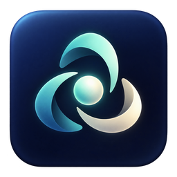
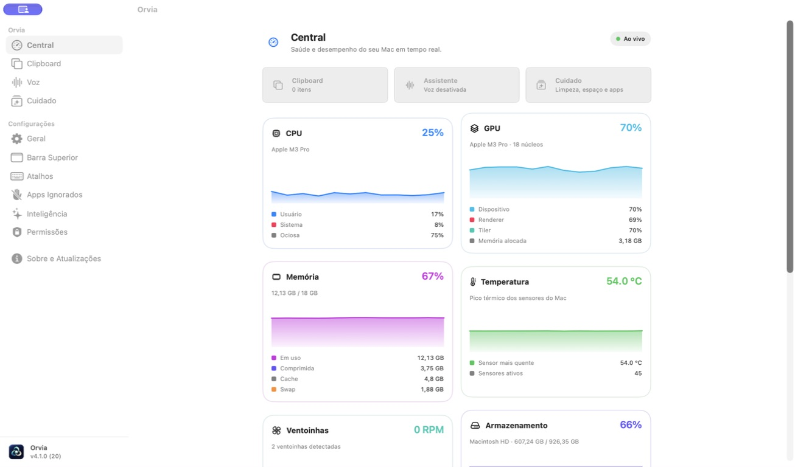
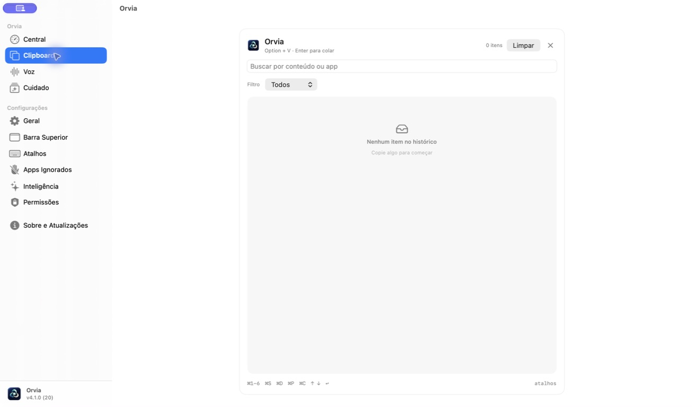
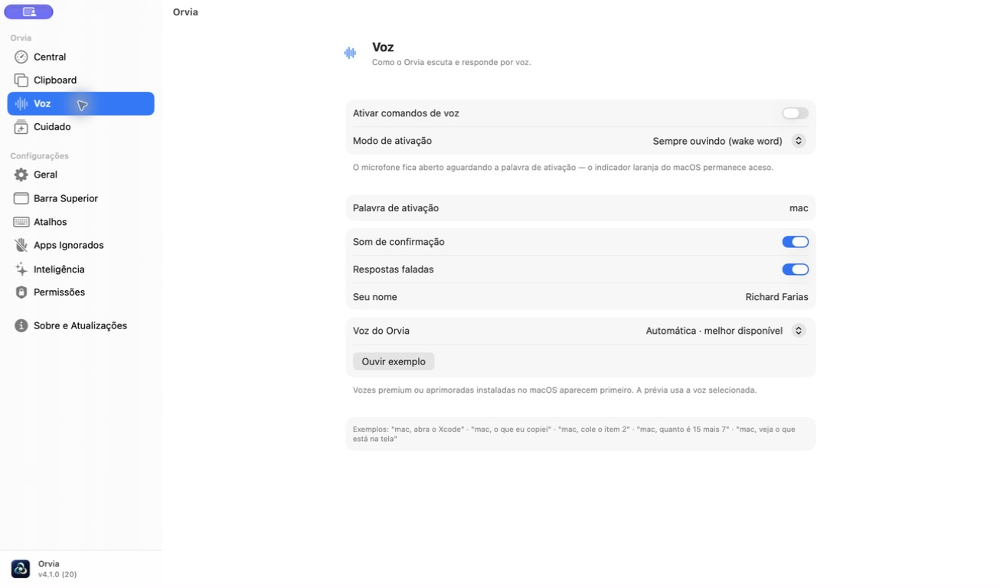
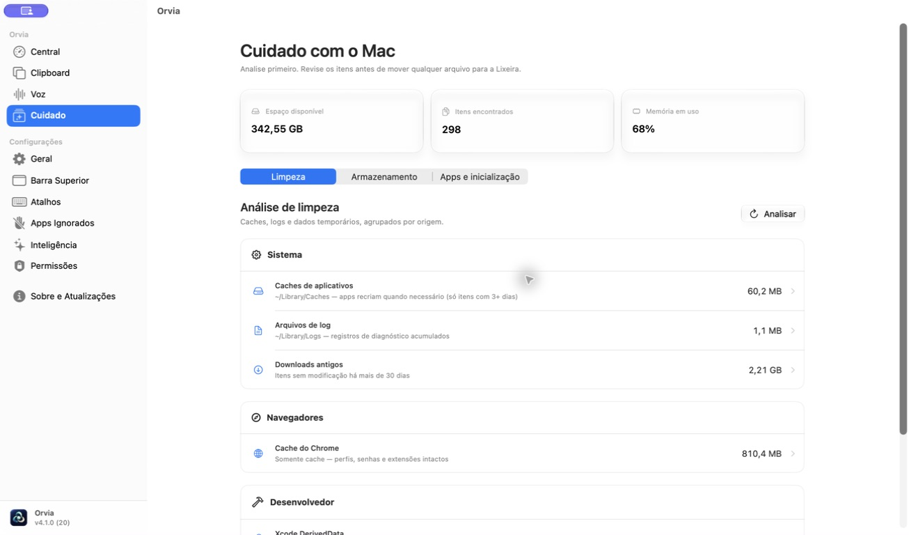
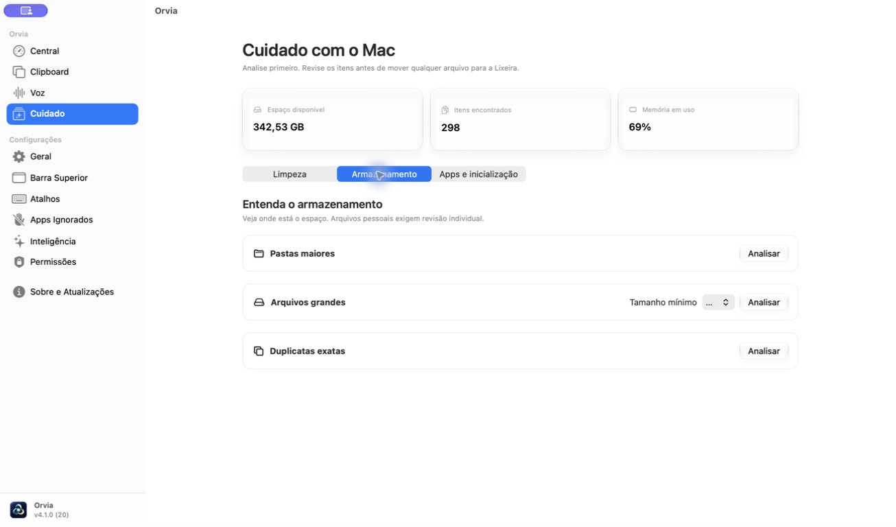
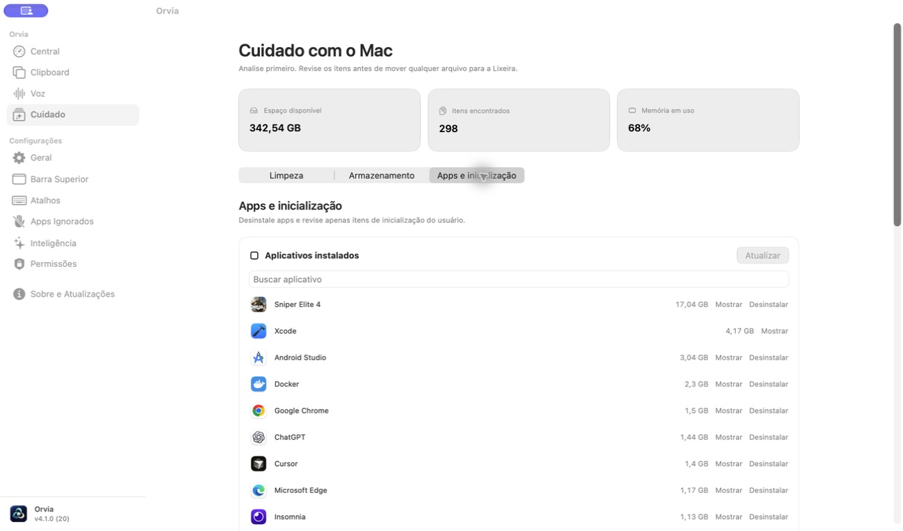
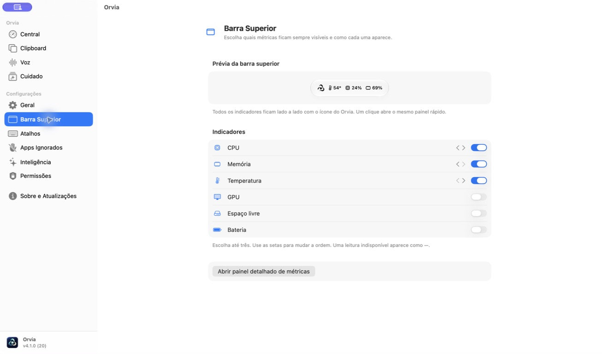

<p align="center">
  
</p>

<h1 align="center">Orvia</h1>

<p align="center"><strong>Seu Mac, em um lugar só.</strong><br>
Clipboard, voz, desempenho e cuidado em um aplicativo nativo para macOS.</p>

<p align="center">
  <a href="#conheça-o-orvia">Conheça o app</a> ·
  <a href="#como-instalar">Como instalar</a> ·
  <a href="#privacidade-e-permissões">Privacidade</a> ·
  <a href="#para-desenvolvedores">Desenvolvimento</a>
</p>

> **Versão do código: 4.1.0 (build 20).** Esta versão está pronta para compilar neste repositório. A [página de releases](https://github.com/richardfariax/clip-flow/releases) pode exibir uma versão anterior até a publicação da tag `4.1.0`.



## Conheça o Orvia

O Orvia coloca as tarefas que você consulta ao longo do dia na mesma janela. Abra a **Central** para ver o estado do Mac; use o **Clipboard** para recuperar o que copiou; fale com o assistente; e entre em **Cuidado** para analisar espaço, limpeza e aplicativos. As mesmas áreas usam navegação e superfícies consistentes, com o visual translúcido do macOS onde ele ajuda a leitura.

### Clipboard que acompanha seu ritmo

Busque texto e imagens copiados, fixe itens importantes, salve snippets e monte uma pilha de colagem. O painel rápido abre com `⌥V`. Com a permissão de Acessibilidade, `Enter` cola no aplicativo anterior; sem ela, o item fica pronto para `⌘V`.



### Voz no seu idioma

Acione por `⌥⇧V` ou ative uma palavra de chamada opcional. O reconhecimento usa o Speech do macOS e prefere processamento no dispositivo quando disponível. As respostas faladas usam uma voz instalada no sistema. O modo de palavra de chamada mantém o microfone ativo enquanto espera o comando; o macOS mostra seu indicador de uso.

Escolha e ouça uma prévia das vozes instaladas, inclusive opções premium quando disponíveis. A conversa ajuda a definir prioridades, dividir tarefas e redigir textos; ações do Mac são confirmadas imediatamente. Para perguntas que exigem dados atuais, o Orvia consulta a web quando esse contexto está ativado e avisa se não consegue confirmar a resposta.



### Cuidado, com revisão antes de agir

**Limpeza**, **Armazenamento** e **Apps e inicialização** vivem na mesma área. O Orvia analisa caches, logs e outros arquivos temporários por origem. Você escolhe o que mover para a Lixeira; arquivos pessoais e duplicatas exigem revisão individual.



Veja pastas maiores, arquivos grandes e duplicatas exatas sem remover nada automaticamente.



Revise o tamanho dos aplicativos instalados e os itens de inicialização em uma única tela.



### Métricas sempre à vista

CPU, memória e temperatura podem aparecer lado a lado com seus próprios ícones na barra superior. Escolha até três indicadores e sua ordem em uma prévia ao vivo. Um clique no conjunto abre o mesmo painel rápido do Orvia. A Central também mostra GPU, armazenamento, rede, sensores térmicos e ventoinhas conforme a disponibilidade do Mac; leituras ausentes aparecem como indisponíveis.



## Como instalar

**Requisitos:** Mac com Apple Silicon e macOS 27 ou posterior. Para compilar, use Xcode 27 e [XcodeGen](https://github.com/yonaskolb/XcodeGen).

Para experimentar o código 4.1.0 agora:

```bash
xcodegen generate
xcodebuild -project Orvia.xcodeproj -scheme Orvia -configuration Release -destination 'platform=macOS,arch=arm64' CODE_SIGNING_ALLOWED=NO build
```

`Scripts/release.sh` gera um ZIP local e `Scripts/release_dmg.sh` gera um DMG local em `build/`. Esses artefatos locais não são assinados nem notarizados. Para uma versão publicada e assinada, acompanhe os [releases](https://github.com/richardfariax/clip-flow/releases). O [cask Homebrew deste repositório](Casks/orvia.rb) aponta para o DMG da release mais recente; use-o após a publicação do `Orvia.dmg`.

## Privacidade e permissões

- Histórico e métricas ficam no Mac. A criptografia AES-GCM local é opcional; a chave fica no Keychain. Conteúdo que o sistema marca como privado ou transitório não entra no histórico.
- O Orvia pede permissões conforme a função usada: **Acessibilidade** para colagem automática; **Microfone** e **Reconhecimento de Fala** para voz; **Gravação de Tela** para recursos que analisam ou capturam a tela. Os atalhos globais não exigem Input Monitoring.
- A síntese de fala usa o macOS. Algumas consultas opcionais, como busca na web e clima, acessam a internet quando você as aciona.
- Ao migrar do app anterior, preferências compatíveis e a base SwiftData são copiadas uma vez. Os dados de origem permanecem para recuperação; o novo histórico fica em `~/Library/Application Support/Orvia/clipboard.store`.

## Para desenvolvedores

`project.yml` é a fonte do projeto Xcode. O código organiza ciclo de vida em `App`, modelos e serviços em `Core`, e interface SwiftUI/AppKit em `UI`. Monitores de métricas e clipboard pertencem ao ciclo de vida do app, inclusive quando a janela está fechada.

```bash
./Scripts/version.sh check
xcodebuild -project Orvia.xcodeproj -scheme Orvia -destination 'platform=macOS,arch=arm64' CODE_SIGNING_ALLOWED=NO test
```

`Scripts/generate_brand_assets.py` reproduz os ícones a partir do master em `Orvia/Resources/Brand`. O workflow de publicação compila, assina e notariza os artefatos quando os segredos de distribuição da Apple estão configurados.

<details>
<summary>Problemas comuns</summary>

- **A colagem apenas copia o item:** conceda Acessibilidade em Permissões e, enquanto isso, use `⌘V`.
- **Voz indisponível:** verifique Microfone, Reconhecimento de Fala e o idioma configurado.
- **Sensor sem leitura:** a disponibilidade depende do modelo e das APIs do macOS.
- **Histórico anterior ausente:** confira `~/Library/Application Support/default.store` e `~/Library/Application Support/Orvia/clipboard.store`. A migração preserva a base de origem.

</details>

Desenvolvido por Richard Farias.
